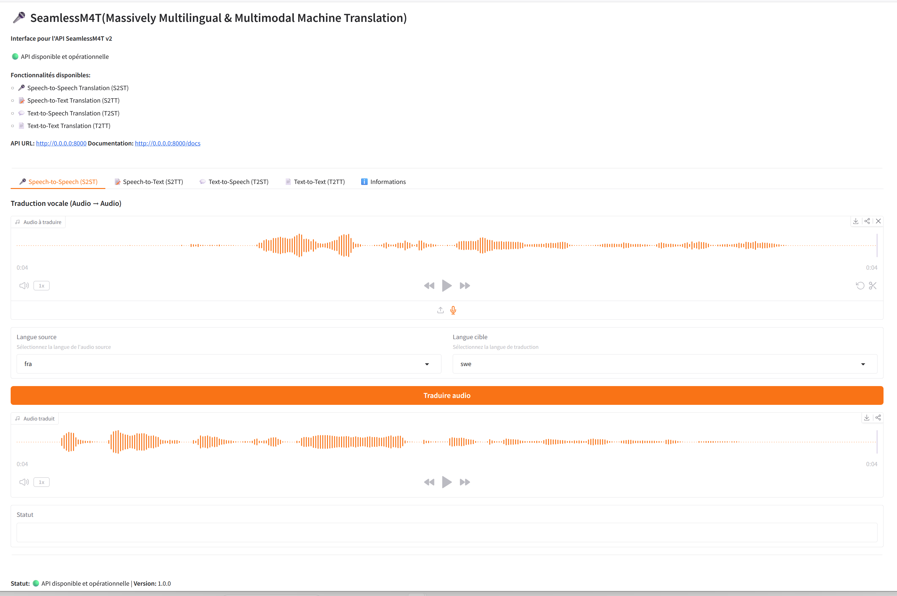

# SeamlessM4T API v2


**Unified API for SeamlessM4T v2 translation services**


![image.png]




## 📋 Description

This API provides a unified interface to use the capabilities of Meta's **SeamlessM4T v2** model. It offers four main multilingual translation and transcription services:

- **Speech-to-Speech Translation (S2ST)** : Direct speech translation
- **Speech-to-Text Translation (S2TT)** : Speech transcription and translation
- **Text-to-Speech Translation (T2ST)** : Multilingual speech synthesis
- **Text-to-Text Translation (T2TT)** : Text translation

## 🚀 Features

### Available Services

| Service | Description | Endpoint |
|---------|-------------|----------|
| **S2ST** | Speech translation (audio → audio) | `POST /api/v1/s2st` |
| **S2TT** | Speech transcription (audio → text) | `POST /api/v1/s2tt` |
| **T2ST** | Speech synthesis (text → audio) | `POST /api/v1/t2st` |
| **T2TT** | Text translation (text → text) | `POST /api/v1/t2tt` |

### Supported Languages

The API supports **40+ languages** including:
- French, English, Spanish, German, Italian
- Chinese, Japanese, Korean, Arabic
- Russian, Portuguese, Hindi, and many more

Check the `/api/v1/languages` endpoint for the complete list.

## 🛠️ Installation

### Prerequisites

- **Python** : 3.8+ (3.10 recommended)
- **CUDA** : 12.6+ (optimized for this version)
- **NVIDIA Drivers** : 561.17+ (compatible with your setup)
- **RAM** : 16GB+ (32GB+ recommended for GPU)
- **VRAM** : 24GB+ (required for large model)
- **Disk space** : 10GB+ (20GB+ recommended for caches)
- **NVIDIA Container Toolkit** : For Docker GPU support

### NVIDIA Container Toolkit Installation

```bash
# Add NVIDIA repository
distribution=$(. /etc/os-release;echo $ID$VERSION_ID) \
&& curl -s -L https://nvidia.github.io/nvidia-docker/gpgkey | sudo apt-key add - \
&& curl -s -L https://nvidia.github.io/nvidia-docker/$distribution/nvidia-docker.list | sudo tee /etc/apt/sources.list.d/nvidia-docker.list

# Install toolkit
sudo apt-get update && sudo apt-get install -y nvidia-docker2
sudo systemctl restart docker

# Verify installation
docker run --rm --gpus all nvidia/cuda:12.6.0-base-ubuntu22.04 nvidia-smi
```

### Installation Steps

```bash
# Clone the repository
git clone https://github.com/votre-repo/seamlessm4t_api.git
cd seamlessm4t_api

# Create virtual environment (recommended)
uv venv --python 3.13.0
source .venv/bin/activate  # Linux/Mac
# .venv\Scripts\activate  # Windows

# Install dependencies
uv pip install git+https://github.com/huggingface/transformers.git sentencepiece
uv sync

# Launch the API
uv run main.py
```

## 📡 Usage

### Launching the API

```bash
# Launch only FastAPI
python main.py --api

# Launch only Gradio interface
python main.py --gradio

# Launch both (default)
python main.py --both

# Debug mode
python main.py --debug
```

### Usage Examples

#### 1. Speech Translation (S2ST)

```bash
curl -X POST "http://localhost:8000/api/v1/s2st" \
  -F "audio_file=@audio_francais.wav" \
  -F "src_lang=fra" \
  -F "tgt_lang=eng"
```

#### 2. Speech Transcription (S2TT)

```bash
curl -X POST "http://localhost:8000/api/v1/s2tt" \
  -F "audio_file=@audio_francais.wav" \
  -F "src_lang=fra" \
  -F "tgt_lang=eng"
```

#### 3. Speech Synthesis (T2ST)

```bash
curl -X POST "http://localhost:8000/api/v1/t2st" \
  -H "Content-Type: application/json" \
  -d '{"text": "Bonjour le monde", "src_lang": "fra", "tgt_lang": "eng"}'
```

#### 4. Text Translation (T2TT)

```bash
curl -X POST "http://localhost:8000/api/v1/t2tt" \
  -H "Content-Type: application/json" \
  -d '{"text": "Bonjour le monde", "src_lang": "fra", "tgt_lang": "eng"}'
```

## 🎯 Gradio Interface

The API includes a Gradio user interface to easily test all features:

```bash
# Access the interface
http://localhost:7860
```


## 📊 Performance

### Recommended Configuration

- **GPU** : NVIDIA RTX 3090/4090 or A100 (with drivers 561.17+)
- **CUDA** : Version 12.6+ (optimized for this version)
- **CPU** : 8+ cores (16+ recommended for heavy loads)
- **RAM** : 32GB+ (64GB+ recommended for batch processing)
- **VRAM** : 24GB+ (required for seamless-m4t-v2-large model)

### Optimizations

- **Single model loading** : The model is loaded once and shared across all services via singleton
- **Optimized GPU management** : Automatic GPU memory cleanup after 5 requests
- **Segment processing** : Automatic handling of long audios/texts (>60s or >5000 characters)
- **CUDA 12.6 support** : Specific optimizations for latest GPU architectures
- **Optimized Docker** : Configuration specially adapted for CUDA 12.6 and drivers 561.17+

### Benchmarks (estimates)

| Configuration | Loading time | Average latency | Throughput |
|---------------|-------------------|-----------------|--------|
| RTX 3090 (24GB) | ~15-20s | ~2-5s/request | ~12 req/min |
| RTX 4090 (24GB) | ~10-15s | ~1-3s/request | ~20 req/min |
| A100 (40GB) | ~8-12s | ~0.5-2s/request | ~30 req/min |

## 🔧 Configuration

Modify the `config.py` file to customize:

```python
# Ports
FASTAPI_PORT = 8000
GRADIO_SERVER_PORT = 7860

# Model
MODEL_NAME = "facebook/seamless-m4t-v2-large"
SAMPLING_RATE = 16000

# Limits
MAX_AUDIO_DURATION = 60  # seconds
MAX_TEXT_LENGTH = 5000   # characters

# GPU
USE_GPU = True
GPU_CLEANUP_INTERVAL = 5  # Cleanup after N requests
```

## 🧪 Tests

```bash
# Test health status
curl http://localhost:8000/api/v1/health

# List supported languages
curl http://localhost:8000/api/v1/languages

# Access Swagger documentation
http://localhost:8000/docs

# Access ReDoc documentation
http://localhost:8000/redoc
```

## 📦 Deployment

### With Docker (recommended)

```bash
# Build the image
docker-compose build

# Start containers
docker-compose up -d

# Check logs
docker-compose logs -f

# Stop containers
docker-compose down
```

**Docker requirements**:
- NVIDIA Container Toolkit installed
- NVIDIA drivers 561.17+ (recommended)
- CUDA 12.6+ (optimized for this version)
- Docker 20.10+

**Docker features**:
- Full GPU support with CUDA 12.6
- Isolated Python environment
- Persistence of audio files and results
- Built-in health checks
- Performance-optimized configuration

### With systemd

```ini
# /etc/systemd/system/seamlessm4t-api.service
[Unit]
Description=SeamlessM4T API Service
After=network.target

[Service]
User=your_user
WorkingDirectory=/path/to/seamlessm4t_api
ExecStart=/path/to/venv/bin/python main.py --api
Restart=always
Environment="PATH=/path/to/venv/bin:/usr/local/sbin:/usr/local/bin:/usr/sbin:/usr/bin:/sbin:/bin"

[Install]
WantedBy=multi-user.target
```

## 🤝 Contribution

Contributions are welcome! Please follow these steps:

1. Fork the project
2. Create a branch (`git checkout -b feature/my-feature`)
3. Commit your changes (`git commit -m 'Add my feature'`)
4. Push the branch (`git push origin feature/my-feature`)
5. Open a Pull Request

## 📜 License

This project is licensed under MIT. See the `LICENSE` file for details.

## 📞 Support

For any questions or issues:
- Open an issue on GitHub
- Check the [official SeamlessM4T documentation](https://github.com/facebookresearch/seamless_communication)

## 🎓 Advanced Examples

### Batch Processing

```python
import requests
import os

def batch_translate(audio_files, src_lang, tgt_lang):
    results = []
    for audio_file in audio_files:
        with open(audio_file, 'rb') as f:
            files = {'audio_file': f}
            data = {'src_lang': src_lang, 'tgt_lang': tgt_lang}
            
            response = requests.post(
                'http://localhost:8000/api/v1/s2st',
                files=files,
                data=data
            )
            
            if response.status_code == 200:
                results.append(response.json())
    
    return results

# Usage
files = ['audio1.wav', 'audio2.wav', 'audio3.wav']
results = batch_translate(files, 'fra', 'eng')
```

### Integration with other services

```python
from fastapi import FastAPI
import httpx

app = FastAPI()

SEAMLESS_API_URL = "http://localhost:8000/api/v1"

@app.post("/translate-audio")
async def translate_audio(audio_url: str, src_lang: str, tgt_lang: str):
    async with httpx.AsyncClient() as client:
        # Download audio
        audio_response = await client.get(audio_url)
        
        # Send to SeamlessM4T API
        files = {'audio_file': audio_response.content}
        data = {'src_lang': src_lang, 'tgt_lang': tgt_lang}
        
        response = await client.post(
            f"{SEAMLESS_API_URL}/s2st",
            files=files,
            data=data
        )
        
        return response.json()
```

## 🚨 Limitations

- Maximum audio duration: 60 seconds (automatic segmentation for longer audios)
- Maximum text length: 5000 characters (automatic segmentation for longer texts)
- Requires internet connection for initial model download

## 📊 Metrics

The API exposes health and usage metrics:

```json
{
  "status": "healthy",
  "model_loaded": true,
  "device": "cuda",
  "gpu_available": true,
  "gpu_memory": {
    "total": 23.7,
    "free": 12.5,
    "used": 11.2
  },
  "services": {
    "s2st": {"model_loaded": true, "device": "cuda", ...},
    "s2tt": {"model_loaded": true, "device": "cuda", ...},
    "t2st": {"model_loaded": true, "device": "cuda", ...},
    "t2tt": {"model_loaded": true, "device": "cuda", ...}
  }
}
```

## 🔍 Troubleshooting

### Common Issues

**1. GPU memory error**
- Solution: Reduce `MAX_AUDIO_DURATION` or use a GPU with more VRAM

**2. Model not loaded**
- Solution: Check internet connection and disk space

**3. Unsupported language errors**
- Solution: Check language codes with `/api/v1/languages`

### Logs

Logs are available in the console and can be redirected to a file:

```bash
python main.py > api.log 2>&1 &
```

## 📈 Roadmap

- Add JWT authentication
- Websocket support for streaming
- Integration with other translation models
- Optimization for serverless deployments

## 🙏 Acknowledgments

- Facebook Research team for the SeamlessM4T model
- HuggingFace community for Transformers tools
- All open source contributors

---

© 2024 SeamlessM4T API | Version 1.0.0